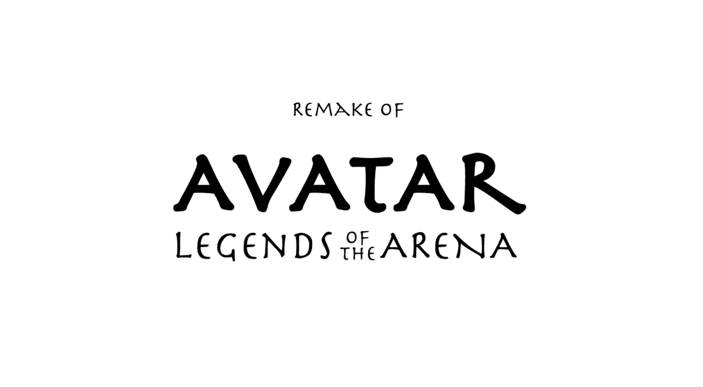

  
  

The Avatar: Legend of the Arena Remake is a passion project I worked on with a friend. It is a remake of the original Nickelodeon game based on the show Avatar: The Last Airbender. We developed the game in Unity with Photon Networking for the multiplayer aspect.

Although I didn't create the 3D models, I edited and tweaked the animations to match my vision for the gameplay and handled all of the programming. This project was a fun and challenging hobby, completed in one month with the help of a friend who contributed to the visual effects (VFX).

The project gave me experience working with Unity's animation system, Photon Networking for real-time multiplayer functionality, and collaborating on game development in a short timeframe.

 
Source: <a href="https://www.youtube.com/watch?v=ueNx3lF6GQE">Preview</a>
